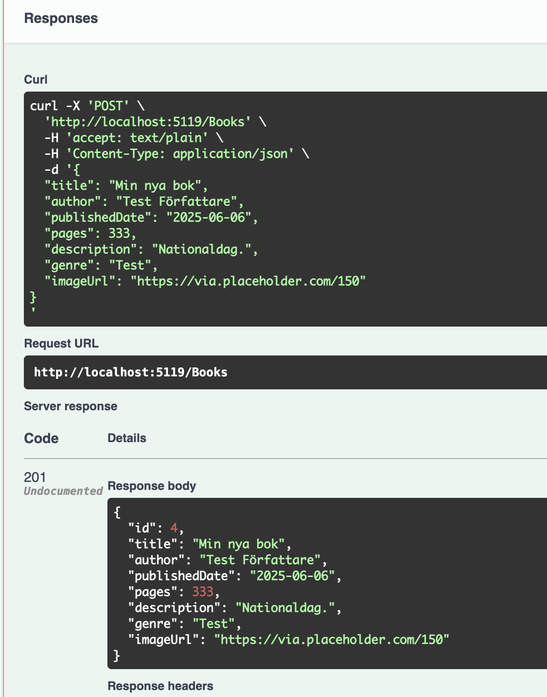
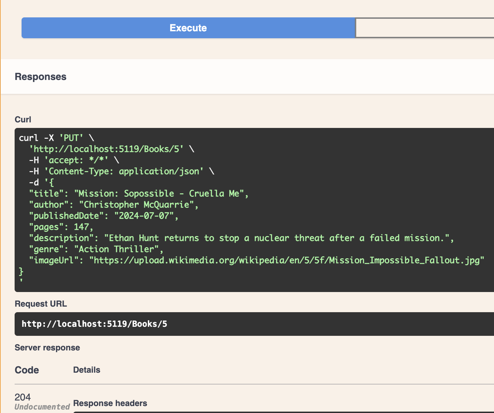
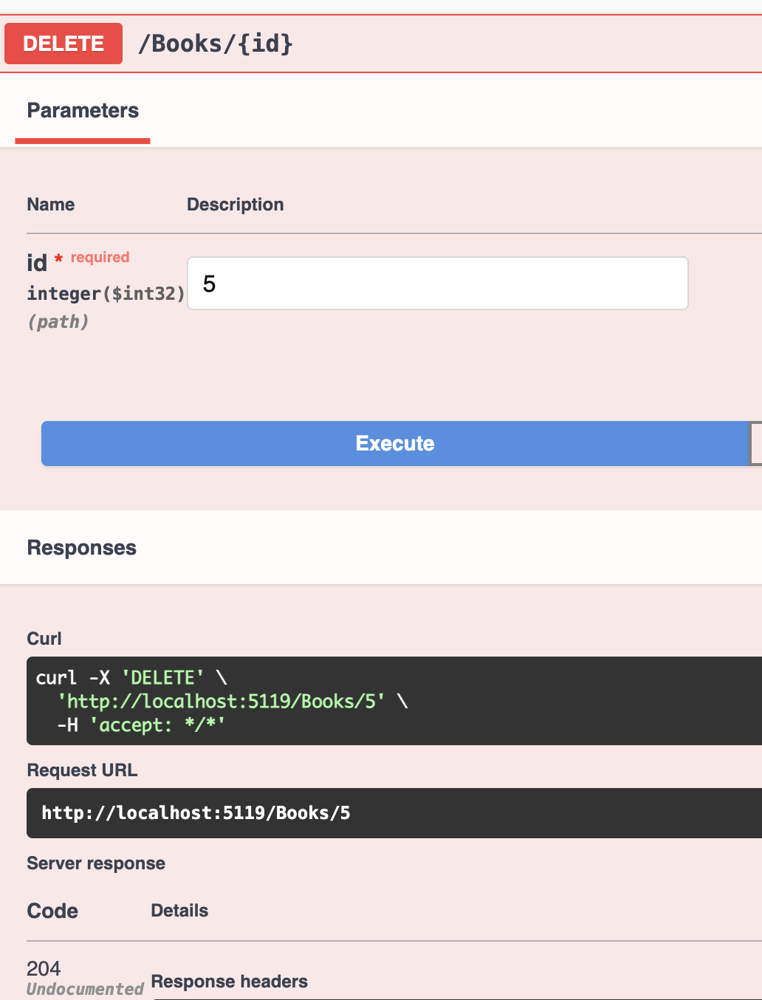

# CRUD Book REST API – med .NET 9 och VS Code
## 🌐 Live API
 [Öppna API i webbläsare](https://dotnet-backend-production-xxxx.up.railway.app/books)

### Testa API:t
1. Starta server: dotnet run
2. Testa API med Swagger

###  Hämta alla böcker (GET /Books)

1. Gå till Swagger: `http://localhost:5119/swagger`
2. Klicka på `GET /Books`
3. Tryck på **Try it out** och sedan **Execute**
4. En lista med alla böcker i svaret
 
[Get-test]

###  Lägg till ny bok (POST)
Så här skapar du en bok:



###  Uppdatera (PUT)
Exempel på PUT för att uppdatera en bok:


###  Radera bok (DELETE)
Så här ser det ut när man tar bort en bok:


---

## Beskrivning
- Backend-API-projekt byggt med .NET 9 och C#, 
testat med REST Client i VS Code.  
- Nybörjare som vill förstå grunderna i web API-utveckling
med minimal setup.

##  Strukturöversikt

```cs
dotnet-backend/
├── Controllers/
│   └── HelloController.cs
├── Program.cs
├── test.http
└── README.md
```

## Steg-för-steg Guide
1.  Skapa projektet

```bash

dotnet new webapi -n dotnet-backend
```
- Detta skapade mappen:

```bash

dotnet-backend/dotnet-backend
```
- För att undvika dubbla mappar:

```bash

mv dotnet-backend/dotnet-backend/* dotnet-backend/
mv dotnet-backend/dotnet-backend/.* dotnet-backend/  # om dolt innehåll
rm -r dotnet-backend/dotnet-backend
```

2. Öppna i VS Code
- Eftersom VS Code redan är installerat:

```bash
cd dotnet-backend
code .
```

3.  Lägg till controller
- Skapa filen Controllers/HelloController.cs:

4.  Kontrollera Program.cs
- Se till att detta finns i Program.cs:

```csharp
builder.Services.AddControllers();
app.MapControllers();
```

5. Starta servern
```bash
dotnet run
Svar:

Now listening on: http://localhost:5119
```
6. Testa i webbläsare
Öppna i valfri webbläsare:

http://localhost:5119/Hello
- Du bör se:

CRUD Book REST API

7.  Testa med REST Client (valfritt)
- Skapa en fil `test.http`:
GET http://localhost:5119/Hello

- Klicka på Send Request.
Om inget syns i svaret – testa istället i webbläsaren.

###  Nybörjarbegrepp
#### Begrepp	Betydelse
- Controller	Klass som hanterar API-rutter
- Route("[controller]")	Använder klassnamn som URL (t.ex. /Hello)
- Program.cs	Huvudfil där appen startas
- dotnet run	Startar applikationen
- GET	HTTP-metod för att hämta data

#### Vanliga problem
> Ändring syns inte?
➤ Stäng servern (Ctrl + C) och kör dotnet run igen

> Ingen respons i REST Client?
➤ Testa i webbläsaren istället


### Begrepp

| Term              | Betydelse                                                       |
| ----------------- | --------------------------------------------------------------- |
| **CORS**          | Säkerhetsmekanism som kräver godkännande för cross-origin-anrop |
| **Origin**        | Domän + port (t.ex. `localhost:4200`)                           |
| **Middleware**    | Kod som körs mellan request och response                        |
| **Authorization** | Behörighetskontroll (valfritt i enkla API)                      |

---

 ## Enkel .NET Web API för Böcker

- en enkel REST API som hanterar böcker – byggd med .NET 7, C#,
 och minneslagring (ingen databas)

###  Model
```csharp
public class Book {
  public int Id { get; set; }
  public string Title { get; set; } = "";
  public string Author { get; set; } = "";
  ...
}
```

## DTO (Data Transfer Object)
- DTO används för att definiera vilken inmatning som API:t 
tillåter vid t.ex. POST/PUT.

## Validering (Validation)
- attribut som [Required] för att säkerställa att fälten är ifyllda.

- [Required]: kräver värde

- [MaxLength(100)]: begränsar längden på text

---

## 📘 Exempel: Hämta alla böcker via `/api/books`

När en användare skickar en HTTP GET-förfrågan till `/api/books`, sker följande tekniska flöde:

1. **BooksController** tar emot förfrågan:
```csharp
   [HttpGet]
   public async Task<List<Book>> Get() => await _bookService.GetAsync();
```

2. BookService.GetAsync() anropas från kontrollern:

- Denna metod hämtar alla dokument från books-kollektionen i MongoDB.

3. MongoDB används för att läsa data:
4. Resultatet (en lista av Book-objekt) returneras som JSON till användaren.

### Kortfattad förklaring av MongoDB-annoteringar (Attributes)

| Attribut (C#)                             | Betydelse (på svenska)                                                          |
| ----------------------------------------- | ------------------------------------------------------------------------------- |
| `[BsonId]`                                | Denna egenskap används som dokumentets `_id` i MongoDB                          |
| `[BsonRepresentation(BsonType.ObjectId)]` | I C# är det en `string`, men lagras som `ObjectId` i MongoDB                    |
| `[BsonElement("title")]`                  | Fältets namn i databasen tvingas till `"title"` (användbart vid namnskillnader) |
